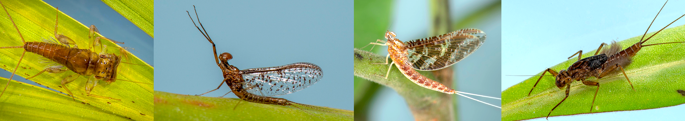

**EphemBrazil** is a database intended to gather and make available distributional and basic taxonomic information on species of Ephemeroptera (Insecta) recorded from Brazil. Species distribution data have been extracted directly from peer-reviewed literature whenever the geographic information could be obtained [i.e., especially from papers dealing with species description, additional distributional records, as well as Molineri et al. (2019, 2020)]. Only valid species data is presented here and will be regularly updated.

We look forward to expanding this database and strongly recommend the submission of data, published or unpublished (personal communication). Get in touch by sending an email to [otavio.fernandes\@ufv.br](mailto:otavio.fernandes@ufv.br){.email} to receive instructions on how to submit your data.

Authors and maintainers:\
Otávio Luiz Fernandes\
Emerson M. Del Ponte\
Frederico Falcão Salles

### References

Molineri, C., Nieto, C., & Domínguez, E. (2019). Direct analysis of vicariance in Neotropical mayflies (Ephemeroptera). Anais da Academia Brasileira de Ciências, 91(4) 1-13.

Molineri, C., Nieto, C., Dos Santos, D. A., Emmerich, D., Zúñiga, M. D. C., Fierro, P., ... & Domínguez, E. (2020). Do mayflies (Ephemeroptera) support a biogeographic transition zone in South America?. Journal of Biogeography, 47(9), 1980-1993.
